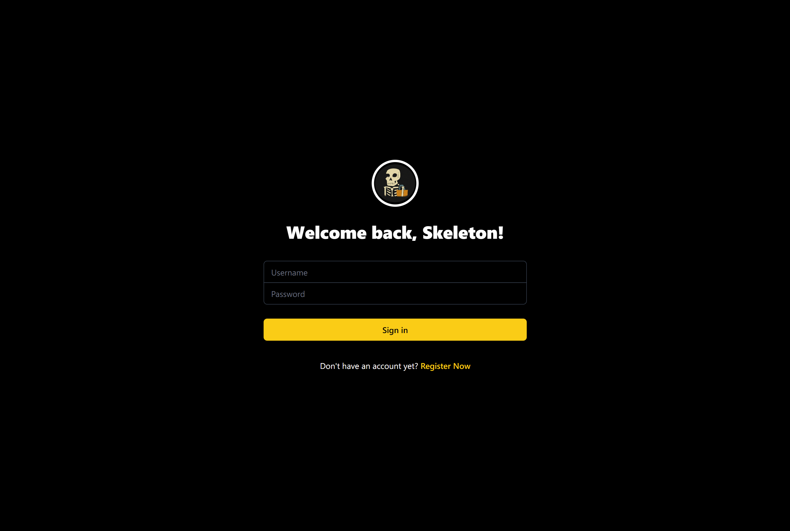
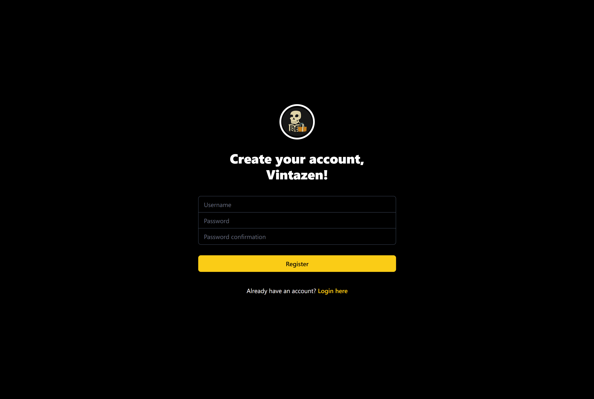
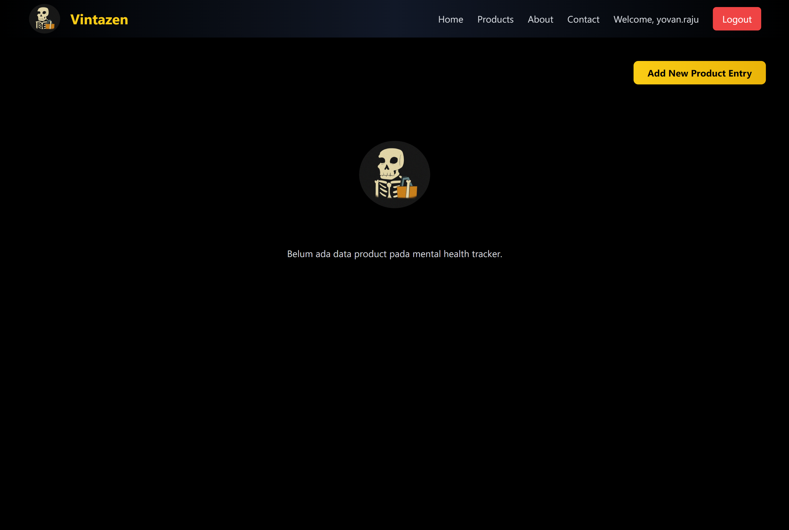

    VINTAZEN

## 🔗 LINK WEB

## Daftar Isi
- [Tugas 2](#tugas-2)
- [Tugas 3](#tugas-3)
- [Tugas 4](#tugas-4)
- [Tugas 5](#tugas-5)
- [Tugas 6](#tugas-6)

# TUGAS 2

Klik untuk melihat detail Tugas 2

## JAWABAN

### Jelaskan bagaimana cara kamu mengimplementasikan checklist di atas secara step-by-step (bukan hanya sekadar mengikuti tutorial).

1. 

    Pada pertama kali saya mendownload django dan menginstalnya, serta beberapa library dan package lainnya yang digunakan dalam contoh program saya ada di `"requirements.txt"`. Saya membuat proyek dengan format django seperti berikut `django-admin startproject <nama_project> .` dan nama project saya adalah vintazen setelah itu otomatis akan terbuat direktori vintazen

 

2. 

    Kedua saya menuliskan perintah `python manage.py startapp main` yang dimana ini berguna untuk membuat direktori main yang berisikan struktur Django

 

3. 

    Ketiga kita harus menambahkan 'main' pada file `setting.py` dalam direktori vintazen dan juga mengatur routing URL pada direktori main, di dalam file `urls.py` untuk melakukan routing agar dapat menjalankan aplikasi main

4. 

    Keempat karena kita disuruh memiliki atribut wajib yaitu name, price, description yang dimana harus kita buat dalam file `models.py` di dalam direktori main untuk variabel name berisi models.`name = CharField(max_length=255)` dimana max_length=255 ini opsional dalam arti angkanya tetapi harus ada max lengthnya, untuk variabel price berisikan `price = models.IntegerField()` dan variabel description berisikan `description = models.TextField()`

5. 

    Untuk menampilkan nama aplikasi serta nama dan kelas saya menambahkan fungsi render dari modul django.shortcuts fungsi render ini untuk menampilkan data yang kita berikan.

6. 

    Saya membuat fungsi di `views.py` dalam main untuk merender template HTML. Setelah itu membuat file HTML di direktori main untuk nampilin data. Saya juga menambahkan `urls.py` di main untuk menghubungkan ke URL vintazen. untuk mengecek itu saya menjalankan http://localhost:8000/

7. 

    Saya membuat proyek baru di PWS bernama vintazen, lalu simpan credentials yang diberikan. Setelah itu, menambahkan URL deployment PWS di ALLOWED_HOSTS di `settings.py` proyek Django. Setelah itu saya melakukan `git add`, `commit`, dan `push` ke GitHub, lalu menjalankan perintah dari informasi Project Command di PWS. Setelah itu, ubah nama branch utama menjadi main dengan perintah `git branch -M main`. Terakhir, cek status deployment di PWS, dan akses aplikasi melalui URL deployment yang diberikan.

## Buatlah bagan yang berisi request client ke web aplikasi berbasis Django beserta responnya dan jelaskan pada bagan tersebut kaitan antara `urls.py`, `views.py`, `models.py`, dan berkas `html`.

    Jadi untuk yang pertama client akan membuka URL dengan browser yang mereka gunakan yang dimana itu akan mengirimkan request ke server Django. Kemudian akan terjadi routing yang dimana akan memeriksa URL dengan urls.py. Jika URL benar maka request akan diteruskan ke views.py yang dimana akan terjadi view logic yaitu pengecekan logika sesuai denghan request dan memanggil model dari database, setelah data sudah ada maka akan digabungkan menggunakan template HTML. Setelah selesai di render maka berkas HTML akan dibalikan ke client dalam browsernya sesuai dengan yang client request.

## Jelaskan fungsi git dalam pengembangan perangkat lunak!

    Git adalah sistem kontrol yang paling banyak digunakan dalam pengembangan perangkat lunak. Git berfungsi untuk membantu dalam pengembangan dalam mengelola versi dari setiap kode terutama saat banyak kontributor dalam proyek. Dengan git setiap progammer dapat melihat perubahan dari setiap kode dan dapat mengembalikan kode ke sebelumnya jika terjadi error atau bug. Git sendiri menyediakan branch yang dimana kita dapat memperbaiki bug / error secara terpisah dari dari kode utama.

## Menurut Anda, dari semua framework yang ada, mengapa framework Django dijadikan permulaan pembelajaran pengembangan perangkat lunak?

    Alasan mengapa Django dijadikan permulaan belajar karena Django menggunakan bahasa pemrograman Python yang dimana suda dipelajari di DPP-1 dan Pyhton juga dapat dibilang bahasa pemrograman dasar yang relatif mudah. Django sendiri dibuat untuk membantu progammer dalam membangun proyek dengan fitur out-of-the-box yang dimana dapat membantu pengembang membangun aplikasi yang kuat dan lebih sedikit kode dan waktu pengerjaan. Django juga memiliki komunitas yang besar dan aktif dimana kita dapat menemukan sumber daya pembelajaran, dokumentasi, dan dukungan dari pengguna-pengguna Django.

## Mengapa model pada Django disebut sebagai ORM?

    Dengan django memungkinkan progammer dapat mengakses database menggunakan objek Python, itu membuat Django dapat disebut dengan ORM. Dalam Django mode adalah representasi dari tabel dalam basis data dan setiap model tersebut tertulis sebagai kelas Python. ORM ini memungkinkan pengembang untuk melakukan operasi Create, Read, Update, Delete pada data di database dengan menggunakan bahasa pemrograman Python.Dengan ORM  membuat pengelolaan database menjadi lebih intuitif dan terintegrasi langsung dengan kode, tanpa perlu menulis SQL manual. Dengan alasan itulah mengapa Django dapat disebut sebagai ORM.

# TUGAS 3

Klik untuk melihat detail Tugas 3

## Jelaskan mengapa kita memerlukan data delivery dalam pengimplementasian sebuah platform?

Data delivery sangat penting karena dalam setiap platform baik web atau mobile, terdapat kebutuhan untuk mengirim, menerima, dan menampilkan data antara server dan pengguna. Pengiriman data ini memungkinkan aplikasi berfungsi sesuai harapan, termasuk fitur seperti login, registrasi, dan penyimpanan data secara real-time. Tanpa data delivery yang efisien, platform akan mengalami kesulitan dalam memberikan kenyamanan bagi pengguna.

## Menurutmu, mana yang lebih baik antara XML dan JSON? Mengapa JSON lebih populer dibandingkan XML?

JSON lebih baik dibandingkan XML karena formatnya yang lebih sederhana. JSON memiliki sintaks yang lebih mudah dipahami serta mendukung tipe data seperti string, number, boolean, dan array. JSON juga sangat kompatibel dengan JavaScript, yang merupakan bahasa pemrograman yang banyak digunakan dalam pengembangan aplikasi web. Hal ini membuat JSON lebih cepat dan lebih efisien dalam pertukaran data sehingga membuat JSON lebih populer dibangingkan XML

## Jelaskan fungsi dari method is_valid() pada form Django dan mengapa kita membutuhkan method tersebut?

Method is_valid() dalam form Django digunakan untuk memeriksa apakah data yang di-input oleh pengguna sesuai dengan aturan validasi yang sudah kita tetapkan. Method ini penting karena memastikan bahwa data yang dikirimkan ke database benar dan sesuai format, sehingga mencegah kesalahan input dan melindungi aplikasi dari kemungkinan terjadinya error.

## Mengapa kita membutuhkan csrf_token saat membuat form di Django? Apa yang dapat terjadi jika kita tidak menambahkan csrf_token pada form Django? Bagaimana hal tersebut dapat dimanfaatkan oleh penyerang?

csrf_token berfungsi untuk melindungi aplikasi dari serangan CSRF (Cross-Site Request Forgery), yang merupakan jenis serangan di mana penyerang bisa membuat pengguna yang sudah login melakukan tindakan tanpa sepengetahuannya. Jika form di Django tidak menggunakan csrf_token, penyerang dapat memanfaatkan celah ini untuk melakukan perubahan data tanpa otorisasi yang sah.

## Jelaskan bagaimana cara kamu mengimplementasikan checklist di atas secara step-by-step (bukan hanya sekadar mengikuti tutorial).

1. ###### Membuat Form Input untuk Menambahkan Objek Model

Langkah pertama, saya membuat berkas `forms.py` di dalam direktori `main`. Pada berkas tersebut, saya mendefinisikan form untuk model `Product` dengan menggunakan `ModelForm` dari Django, serta mengimpor model `Product`. Berikut adalah isi kode di dalam `forms.py`:

    from django.forms import ModelForm
    from main.models import ProductEntry

    class ProductEntryForm(ModelForm):
    class Meta:
        model = ProductEntry
        fields = ["name", "price", "description"]

Setelah itu, saya membuat fungsi `create_product_entry` di dalam `views.py` yang berfungsi untuk menangani permintaan (request) dari form input. Fungsi ini memvalidasi data yang dikirimkan oleh pengguna, dan jika valid, data tersebut akan disimpan ke dalam database. Berikut adalah kodenya:

    from django.shortcuts import render, redirect
    from main.forms import ProductForm

    def create_product_entry(request):
    form = ProductForm(request.POST or None)

    if form.is_valid() and request.method == "POST":
        form.save()
        return redirect('main:show_main')

    context = {'form': form}
    return render(request, "create_product_entry.html", context)

Kemudian, saya membuat template HTML bernama `create_product_entry.html` di dalam direktori `main/templates`. Template ini menampilkan form yang telah dibuat dan menyediakan tombol untuk mengirimkan data:

     
    
    <h1>Add New Product Entry</h1>

    <form method="POST">
        
        <table>
            {{ form.as_table }}
            <tr>
                <td></td>
                <td>
                    <input type="submit" value="Add Product Entry" />
                </td>
            </tr>
        </table>
    </form>

    

Selanjutnya, saya menambahkan rute URL di dalam berkas `urls.py` untuk menghubungkan halaman input produk baru dengan fungsi yang telah dibuat sebelumnya:

    from main.views import create_product_entry
    urlpatterns = [...
        path('create-product-entry', create_product_entry, name='create_product_entry'),
        ...
    ]

Menambahkan Fungsi untuk Menampilkan Data dalam Format XML, JSON, dan Berdasarkan ID

Pada tahap berikutnya, saya menambahkan fungsi untuk menampilkan data dalam format XML dan JSON, serta untuk menampilkan data berdasarkan ID. Saya mengimpor modul yang diperlukan di dalam `views.py`:

    from django.http import HttpResponse
    from django.core import serializers

Untuk menampilkan data dalam format XML, saya membuat fungsi show_xml yang mengambil seluruh data produk dan mengembalikannya dalam format XML:

    def show_xml(request):
        data = Product.objects.all()
        return HttpResponse(serializers.serialize("xml", data), content_type="application/xml")

Selanjutnya, untuk menampilkan data dalam format JSON, saya menambahkan fungsi serupa:

    def show_json(request):
        data = Product.objects.all()
        return HttpResponse(serializers.serialize("json", data), content_type="application/json")

Untuk menampilkan data berdasarkan ID, saya membuat dua fungsi tambahan untuk masing-masing format, yaitu XML dan JSON. Fungsi-fungsi ini memfilter data berdasarkan ID tertentu:

    def show_xml_by_id(request, id):
        data = Product.objects.filter(pk=id)
        return HttpResponse(serializers.serialize("xml", data), content_type="application/xml")

    def show_json_by_id(request, id):
        data = Product.objects.filter(pk=id)
        return HttpResponse(serializers.serialize("json", data), content_type="application/json")

Terakhir, saya menambahkan rute untuk masing-masing fungsi ini di dalam berkas urls.py:

    from main.views import show_xml, show_json, show_xml_by_id, show_json_by_id

    urlpatterns = [
        path('xml/', show_xml, name='show_xml'),
        path('json/', show_json, name='show_json'),
        path('xml/<str:id>/', show_xml_by_id, name='show_xml_by_id'),
        path('json/<str:id>/', show_json_by_id, name='show_json_by_id'),
    ]

Dengan langkah-langkah di atas, saya berhasil membuat form input, menampilkan data dalam format XML dan JSON, serta menampilkan data berdasarkan ID. Proses ini memastikan pengguna dapat menambah dan melihat data melalui antarmuka yang interaktif.

### Postman ScreenShot:

   

# TUGAS 4

Klik untuk melihat detail Tugas 4

## Apa perbedaan antara `HttpResponseRedirect()` dan `redirect()`

untuk `HttpResponseRedirect()` ini adalah cara manual untuk kita melakukan redirect di Django. Fungsi itu membuat kita harus memberi URL yang lengkap atau hasil dari fungsi `reverse()`. Sedangkan `redirect()` itu adalah shortcut yang lebih fleksibel karena mebuat kita bisa menggunakan URL, nama URL pattern atau object model untuk argumennya dan Django bakal otomatis membuat URL-nya

## Jelaskan cara kerja penghubungan model `Product` dengan `User`!

Di Program ini yang saya pelajari kita menghubungkan `model Product` dengan `model User` menggunakan ForeignKey. Jadi membuat setiap produk terkait sama 1 user, setekah itu setiap data produk di database akan nyimpen siapa pengguna yang punya product itu. Untuk contoh dalam model:

    from django.contrib.auth.models import User

Dengan menggunakan ForeignKey, kita dapat melakukan filter produk berdasarkan pengguna yang login, contoh:

    Product.objects.filter(user=request.user)

## Apa perbedaan antara authentication dan authorization, apakah yang dilakukan saat pengguna login? Jelaskan bagaimana Django mengimplementasikan kedua konsep tersebut.

Authentication adalah proses memverifikasi identitas pengguna, misalnya dengan meminta username dan password. Saat pengguna melakukan login, proses ini digunakan untuk memastikan bahwa pengguna tersebut adalah orang yang sah menggunakan akun tersebut. Django mengimplementasikan authentication melalui fungsi `authenticate()` dan `login()`. Jika autentikasi berhasil, Django akan membuat sesi untuk pengguna tersebut:

    user = authenticate(username='example', password='secret')
    login(request, user)

Authorization adalah proses mengecek apa yang diizinkan dilakukan oleh pengguna tersebut setelah berhasil login. Misalnya, pengguna dengan hak akses tertentu bisa melihat halaman admin, sementara pengguna lain tidak bisa. Authorization di Django bisa dilakukan melalui permission system bawaan atau menggunakan decorators seperti `@login_required` yang memastikan hanya pengguna yang sudah login yang dapat mengakses halaman tertentu.

## Bagaimana Django mengingat pengguna yang telah login? Jelaskan kegunaan lain dari cookies dan apakah semua cookies aman digunakan?

Django mengingat pengguna yang telah login dengan session. Jadi saat pengguna login, Django akan membuat sebuah sesi di server dan mengirimkan session ID ke browser sebagai cookie. Setiap kali pengguna melakukan request, session ID ini dikirim kembali ke server sehingga Django dapat mengetahui siapa yang login. Cookies juga dapat digunakan untuk menyimpan informasi lain seperti preferensi pengguna, atau untuk melacak aktivitas pengguna di situs. Tidak semua cookies aman digunakan, terutama jika mereka menyimpan informasi sensitif seperti password. Oleh karena itu, Django hanya menyimpan session ID di cookies, sementara data sensitif disimpan di server. Cookies juga bisa dienkripsi dan ditandai sebagai HttpOnly dan Secure untuk meningkatkan keamanan.

## Jelaskan bagaimana cara kamu mengimplementasikan checklist di atas secara step-by-step (bukan hanya sekadar mengikuti tutorial).

###### Mengimplementasikan fungsi registrasi, login, dan logout untuk memungkinkan pengguna untuk mengakses aplikasi sebelumnya dengan lancar.
1. Registrasi

    - Tambahkan `UserCreationForm` ke dalam `views.py` untuk membuat form pendaftaran pengguna baru.

            from django.contrib.auth.forms import UserCreationForm
            from django.contrib import messages
    - Definisikan fungsi `register` di dalam `views.py` untuk menangani pendaftaran pengguna dan menyimpan data pengguna yang baru.
    
            def register(request):
            form = UserCreationForm()

            if request.method == "POST":
                form = UserCreationForm(request.POST)
                if form.is_valid():
                    form.save()
                    messages.success(request, 'Akun Anda berhasil dibuat!')
                    return redirect('login')
            context = {'form': form}
            return render(request, 'register.html', context)
    - Tambahkan path untuk fungsi `register` di dalam `urls.py`:

            from main.views import register

            urlpatterns = [
                ...
                path('register/', register, name='register'),
            ]
    - Buat template register.html untuk menampilkan form pendaftaran:

            

            
            

            <h1>Register</h1>
            <form method="POST">
                
                {{ form.as_p }}
                <button type="submit">Daftar</button>
            </form>
            

            

2. Login

    - Tambahkan `AuthenticationForm`, `authenticate`, dan `login` pada bagian atas `views.py`.

            from django.contrib.auth.forms import AuthenticationForm
            from django.contrib.auth import authenticate, login

    - Definisikan fungsi `login_user` untuk melakukan autentikasi pengguna.

            def login_user(request):
            if request.method == 'POST':
                form = AuthenticationForm(data=request.POST)
                if form.is_valid():
                    user = form.get_user()
                    login(request, user)
                    return redirect('main_page')
            else:
                form = AuthenticationForm()
            return render(request, 'login.html', {'form': form})

    - Tambahkan path untuk fungsi `login_user` di `urls.py:`

            from main.views import login_user

            urlpatterns = [
                ...
                path('login/', login_user, name='login'),
            ]
    
    - Buat template `login.html` untuk menampilkan form login:

            

            
            

            <h1>Login</h1>
            <form method="POST">
                
                {{ form.as_p }}
                <button type="submit">Login</button>
            </form>
            

            

3. Logout
    
    - Tambahkan `logout` ke dalam `views.py` dan buat fungsi `logout_user`.

            from django.contrib.auth import logout

            def logout_user(request):
                logout(request)
                return redirect('login')

    - Tambahkan path untuk `logout_user` di dalam `urls.py`:

            from main.views import logout_user

            urlpatterns = [
                ...
                path('logout/', logout_user, name='logout'),
            ]
    
    - Pada halaman `main.html`, tambahkan tombol logout:

            <a href="">
                <button>Logout</button>
            </a>

###### Membuat dua akun pengguna dengan masing-masing tiga dummy data menggunakan model yang telah dibuat pada aplikasi sebelumnya untuk setiap akun di lokal.

###### Menghubungkan model Product dengan User.

1. Membuat Model Product
    
    - Tambahkan relasi antara `Product` dan `User` dengan menggunakan `ForeignKey` di `models.py`:

            from django.contrib.auth.models import User

            class Product(models.Model):
                user = models.ForeignKey(User, on_delete=models.CASCADE)
                nama_produk = models.CharField(max_length=100)

2. Filter Produk Berdasarkan Pengguna

    - Ubah view di `views.py` agar hanya menampilkan produk milik pengguna yang sedang login.

            def show_products(request):
                products = Product.objects.filter(user=request.user)
                return render(request, 'main.html', {'products': products})

    - Pada halaman `main.html`, tambahkan kode untuk menampilkan produk pengguna yang sedang login:

            <h1>Produk Anda</h1>
            <ul>
            
                <li>{{ product.nama_produk }}</li>
            
            </ul>

###### Menampilkan detail informasi pengguna yang sedang logged in seperti username dan menerapkan cookies seperti last login pada halaman utama aplikasi.

1. Menampilkan Data Pengguna

    - Tambahkan data username pengguna di `context` pada `views.py`.
            
            def show_main(request):
                context = {
                    'username': request.user.username,
                    'products': Product.objects.filter(user=request.user),
                }
                return render(request, 'main.html', context)

2. Menggunakan Cookies untuk Menyimpan Informasi Last Login
    - Di fungsi `login_user`, tambahkan cookie `last_login` setelah login berhasil.

            from django.http import HttpResponseRedirect
            import datetime

            def login_user(request):
                if request.method == 'POST':
                    form = AuthenticationForm(data=request.POST)
                    if form.is_valid():
                        user = form.get_user()
                        login(request, user)
                        response = HttpResponseRedirect(reverse("main_page"))
                        response.set_cookie('last_login', str(datetime.datetime.now()))
                        return response
                else:
                    form = AuthenticationForm()
                return render(request, 'login.html', {'form': form})
    
    - Pada halaman utama main.html, tampilkan data last_login yang disimpan di cookie:

            <h5>Terakhir login: {{ request.COOKIES.last_login }}</h5>

    - Di fungsi logout_user, hapus cookie last_login saat pengguna logout.

            def logout_user(request):
                logout(request)
                response = HttpResponseRedirect(reverse('login'))
                response.delete_cookie('last_login')
                return response

# Tugas 5

Klik untuk melihat detail Tugas 5

###### Jika terdapat beberapa CSS selector untuk suatu elemen HTML, jelaskan urutan prioritas pengambilan CSS selector tersebut!
Ketika elemen HTML memiliki beberapa CSS selector, aturan yang diterapkan bergantung pada spesifisitas dan urutan penulisan CSS. Berikut urutan prioritas dari yang terendah hingga tertinggi:

1. Selector Elemen dan Pseudo-elemen: Memiliki spesifisitas terendah, contoh: `div`, `p`, `::before`.
2. Kelas, Pseudo-class, dan Atribut: Lebih spesifik daripada selector elemen, contoh: `.class`, `:hover`, `[type="text"]`.
3. ID Selector: Memiliki nilai spesifisitas yang lebih tinggi, contoh: `#myId`.
4. Inline Styles: CSS yang ditulis langsung dalam elemen HTML memiliki prioritas tertinggi, contoh: `
`.
5. `!important`: CSS dengan `!important` akan menimpa semua aturan, kecuali jika ada selector lain yang juga menggunakan `!important`. Dalam kasus ini, aturan dengan spesifisitas tertinggi akan diterapkan.

###### Mengapa responsive design menjadi konsep yang penting dalam pengembangan aplikasi web? Berikan contoh aplikasi yang sudah dan belum menerapkan responsive design!
Responsive design adalah pendekatan untuk memastikan aplikasi web tampil optimal di berbagai perangkat dan ukuran layar. Ini penting karena:

1. Penggunaan Perangkat Mobile: Sebagian besar pengguna mengakses internet melalui perangkat mobile. Jika aplikasi tidak responsif, pengguna mungkin akan kesulitan mengaksesnya.
2. SEO: Google memprioritaskan situs yang responsif dalam hasil pencarian.
3. Pengalaman Pengguna: Desain responsif memastikan aplikasi tetap mudah digunakan, terlepas dari ukuran layar.

Contoh Aplikasi yang Menerapkan Responsive Design:

- Spotify Web: Aplikasi ini memastikan pengalaman yang konsisten di berbagai perangkat, baik desktop maupun mobile.
- Airbnb: Layout aplikasi yang menyesuaikan dengan ukuran layar, menyederhanakan navigasi dan konten.

Contoh Aplikasi yang Tidak Menerapkan Responsive Design:

- Old Reddit: Sebagian halaman lama Reddit masih belum responsif, membuat tampilan di perangkat mobile tidak optimal.

###### Jelaskan perbedaan antara margin, border, dan padding, serta cara untuk mengimplementasikan ketiga hal tersebut!

- Margin: Ruang di luar elemen, antara elemen tersebut dan elemen lain.

    Implementasi:

        .element {
        margin: 20px;
        }

- Border: Garis yang mengelilingi elemen.

    Implementasi:

        .element {
        border: 2px solid #000;
        }

- Padding: Ruang di dalam elemen, antara konten dan border elemen tersebut.

    Implementasi:

        .element {
        padding: 15px;
        }

###### Jelaskan konsep flex box dan grid layout beserta kegunaannya!

1. Flexbox: Layout satu dimensi yang mengatur elemen dalam baris atau kolom, ideal untuk menyusun item dalam satu arah.

    - Kegunaan: Membuat layout seperti navbar, footer, dan card layout yang fleksibel.

    - Contoh:

            .container {
            display: flex;
            justify-content: space-between;
            }
2. Grid Layout: Layout dua dimensi yang mengatur elemen dalam baris dan kolom secara bersamaan.

    - Kegunaan: Membuat layout yang lebih kompleks seperti galeri gambar, dashboard, atau layout halaman utama.

    - Contoh:

            .container {
            display: grid;
            grid-template-columns: repeat(3, 1fr);
            grid-gap: 10px;
            }

###### Jelaskan bagaimana cara kamu mengimplementasikan checklist di atas secara step-by-step!

1. Untuk halaman login saya membuat seperti pada gambar dibawah ini

.png>)
jadi saya membuat logo dan mengatur posisi dari form login untuk berada pada bagian tengah dan mengatur warna dari background dan font. Merubah warna dari button menjadi kuning dan mengatur posisi dari textfield nya agar berada di tengah juga. Menamahkan tautan registrasi dengan warna kuning.

Untuk halaman register saya membuat seperti pada gambar dibawah ini

.png>)
jadi saya membuat logo dan mengatur posisi dari form register untuk berada pada bagian tengah dan mengatur warna dari background dan font. Merubah warna dari button menjadi kuning dan mengatur posisi dari textfield nya agar berada di tengah juga. Menamahkan tautan login dengan warna kuning.

2. saya membuat halaman utama menjadi lebih menarik dan mengikuti tema website saya.
    - Jika tidak terdapat produk maka akan menampilkan:
    
    .png>)
    web ini sudah responsive untuk perangkat mobile dan desktop dan pada saat tidak ada produk maka akan menampilkan tulisan "belum ada data product pada Vintazen" dan memberikan animasi pada gambar
    - Jika terdapat produk maka akan menampilkan:
     (1).png>)
    .png>)
    dan web ini sudah responsive untuk perangkat mobile dan desktop dan pada saat terdapat produk maka akan menampilkan produk yang sudah di tambahkan dan dapat di delete dalam bentuk card

3. Saya juga membuat 2 logo pada bagian atas kanan dari card product untuk mengapus dan mengedit produk yang sudah di tambahkan
 (1).png>)
    .png>)

4. Pada bagian navbar saya sudah membuatnya menjadi responsive dan menyesuaikan dengan perangkat yang digunakan dan menambahkan beberapa fitur seperti logout dan beberapa fitur lainnya yang belum saya implementasikan
.png>)
 (2).png>)

# TUGAS 6

Klik untuk melihat detail Tugas 6

## JAWABAN

### Jelaskan manfaat dari penggunaan JavaScript dalam pengembangan aplikasi web!

JavaScript memiliki beberapa manfaat penting dalam pengembangan aplikasi web:

1. Interaktivitas Dinamis: JavaScript memungkinkan manipulasi halaman web secara dinamis, meningkatkan interaksi antara pengguna dan halaman web. Ini membuat aplikasi web lebih responsif dan user-friendly.

2. Client-side Processing: Sebagai bahasa client-side, JavaScript mengurangi beban server dengan memproses beberapa tugas di sisi klien (browser pengguna).

3. Validasi Form: JavaScript dapat melakukan validasi data form sebelum dikirim ke server, meningkatkan user experience dan mengurangi beban server.

4. Manipulasi DOM: Dengan JavaScript, pengembang dapat memanipulasi struktur, gaya, dan konten halaman web secara dinamis melalui DOM (Document Object Model).

5. Asynchronous Programming: JavaScript mendukung pemrograman asinkron, memungkinkan aplikasi web untuk melakukan operasi tanpa menghentikan eksekusi kode lainnya.

6. Cross-platform Compatibility: JavaScript berjalan di hampir semua browser modern, memastikan kompatibilitas lintas platform untuk aplikasi web.

7. Rich User Interfaces: JavaScript memungkinkan pembuatan antarmuka pengguna yang kaya dan interaktif, meningkatkan pengalaman pengguna secara keseluruhan.

8. Event Handling: JavaScript dapat merespon berbagai event pengguna seperti klik mouse, input keyboard, dll., membuat aplikasi web lebih responsif.

9. AJAX : JavaScript memungkinkan penggunaan AJAX untuk memperbarui bagian tertentu dari halaman web tanpa harus me-reload seluruh halaman.

10. Ekstensibilitas: Dengan banyaknya library dan framework JavaScript yang tersedia, pengembang dapat memperluas fungsionalitas aplikasi web dengan mudah.

### Jelaskan fungsi dari penggunaan await ketika kita menggunakan fetch()! Apa yang akan terjadi jika kita tidak menggunakan await?

Penggunaan await dalam konteks fetch() memiliki beberapa fungsi penting:

1. Sinkronisasi Asinkron: await memungkinkan kode asinkron berjalan secara sekuensial, membuat kode lebih mudah dibaca dan dipahami.

2. Menunggu Resolusi Promise: await menunda eksekusi kode selanjutnya sampai Promise yang dikembalikan oleh `fetch()` selesai atau gagal.

3. Penanganan Error: Memungkinkan penggunaan blok try-catch untuk menangani error dalam operasi asinkron dengan cara yang lebih alami.

Jika kita tidak menggunakan await saat memanggil fetch():

1. Eksekusi Non-Blocking: Kode akan terus berjalan tanpa menunggu respons dari `fetch()`, yang bisa menyebabkan masalah jika kode selanjutnya bergantung pada hasil `fetch()`.

2. Penanganan Promise: Kita harus menggunakan metode `.then()` dan `.catch()` untuk menangani hasil atau error dari Promise, yang bisa membuat kode lebih sulit dibaca jika ada banyak operasi asinkron berurutan.

3. Kompleksitas Kode: Kode bisa menjadi lebih kompleks dan sulit dipelihara, terutama ketika ada banyak operasi asinkron yang perlu dikoordinasikan.

### Mengapa kita perlu menggunakan decorator csrf_exempt pada view yang akan digunakan untuk AJAX POST?

Kita perlu menggunakan decorator csrf_exempt pada view yang akan digunakan untuk AJAX POST karena:

1. CSRF Protection: Django secara default menggunakan CSRF protection untuk semua view yang menerima POST request. Ini berarti setiap form POST harus menyertakan CSRF token.

2. AJAX Requests: Ketika melakukan AJAX POST request, terutama dari domain yang berbeda atau dari aplikasi single-page, seringkali sulit atau tidak praktis untuk menyertakan CSRF token dalam setiap request.

3. Bypass CSRF Check: Decorator csrf_exempt memungkinkan view tertentu untuk membypass pengecekan CSRF token. Ini berguna untuk endpoint API atau view yang memang dirancang untuk menerima POST request tanpa CSRF token.

4. Fleksibilitas: Dalam beberapa kasus, seperti ketika mengembangkan API atau ketika keamanan ditangani dengan cara lain, CSRF protection mungkin tidak diperlukan atau bahkan bisa mengganggu fungsionalitas yang diinginkan.

5. Kompatibilitas: Beberapa framework JavaScript atau library AJAX mungkin tidak secara otomatis menangani CSRF token, sehingga menggunakan csrf_exempt bisa menjadi solusi cepat untuk memastikan kompatibilitas.

### Pada tutorial PBP minggu ini, pembersihan data input pengguna dilakukan di belakang (backend) juga. Mengapa hal tersebut tidak dilakukan di frontend saja?

1. Keamanan: Data input pengguna harus divalidasi dan diperbaiki di backend untuk memastikan bahwa data yang diterima aman dan sesuai dengan format yang diharapkan.

2. Validasi: Validasi data input pengguna harus dilakukan di backend untuk memastikan bahwa data yang diterima valid dan sesuai dengan format yang diharapkan.

### Jelaskan bagaimana cara kamu mengimplementasikan checklist di atas secara step-by-step (bukan hanya sekadar mengikuti tutorial)! 

1. Mengubah kode cards data mood untuk mendukung AJAX GET:

Anda telah mengimplementasikan ini dalam fungsi `getProductEntries()` di `main.html`:

        async function getProductEntries() {
            return fetch("").then((res) => res.json())
        }

Fungsi ini mengambil data produk dalam format JSON menggunakan AJAX GET.

2. Pengambilan data mood menggunakan AJAX GET untuk pengguna yang logged-in:

Di views.py, fungsi `show_json()` sudah memastikan bahwa hanya data milik pengguna yang sedang login yang diambil:

        def show_json(request):
            data = Product.objects.filter(user=request.user)
            return HttpResponse(serializers.serialize('json', data), content_type='application/json')

3. Tombol untuk membuka modal dengan form untuk menambahkan mood:

Anda telah mengimplementasikan ini dengan tombol "Add New Product Entry" di `main.html`:

        <button data-modal-target="crudModal" data-modal-toggle="crudModal" class="bg-gradient-to-r from-yellow-400 to-yellow-500 hover:from-yellow-500 hover:to-yellow-600 text-black font-bold py-2 px-6 rounded-lg transition duration-300 ease-in-out transform hover:-translate-y-1 hover:scale-105 shadow-lg" onclick="showModal();">
            Add New Product Entry
        </button>

Modal ini sudah memenuhi persyaratan yang diminta, termasuk membersihkan form setelah penambahan berhasil dan menampilkan pesan error jika gagal.

4. Fungsi view baru untuk menambahkan mood baru:
Anda telah membuat fungsi `add_product_entry_ajax()` di `views.py`:

        def add_product_entry_ajax(request):
            if request.method == 'POST':
                nama_produk = request.POST.get('nama_produk')
                harga_produk = request.POST.get('harga_produk')
                deskripsi_produk = request.POST.get('deskripsi_produk')
                user = request.user
                Product.objects.create(nama_produk=nama_produk, harga_produk=harga_produk, deskripsi_produk=deskripsi_produk, user=user)
                return HttpResponse(b"CREATED", status=201)
                
5. Path /create-ajax/:

Anda telah menambahkan path ini di `urls.py`:

        path('create-ajax/', add_product_entry_ajax, name='add_product_entry_ajax'),

6. Menghubungkan form di modal ke path /create-ajax/:
Ini sudah diimplementasikan dalam fungsi `addProductEntry()` di `main.html`:

        function addProductEntry() {
            const form = document.getElementById('productEntryForm');
            const formData = new FormData(form);

            fetch("", {
            method: "POST",
            body: formData,
            })
            // ... (kode lainnya)
        }

7. Refresh halaman utama secara asinkronus:
Anda telah mengimplementasikan ini dalam fungsi `refreshProductEntries()` di `main.html`:

        async function refreshProductEntries() {
            const productEntries = await getProductEntries()
            let htmlString = ``
            productEntries.forEach((item) => {
            // ...
            })
            document.getElementById("product_entry_cards").innerHTML = htmlString
        }

Fungsi ini dipanggil setelah penambahan produk berhasil, memperbarui daftar produk tanpa me-reload seluruh halaman.

